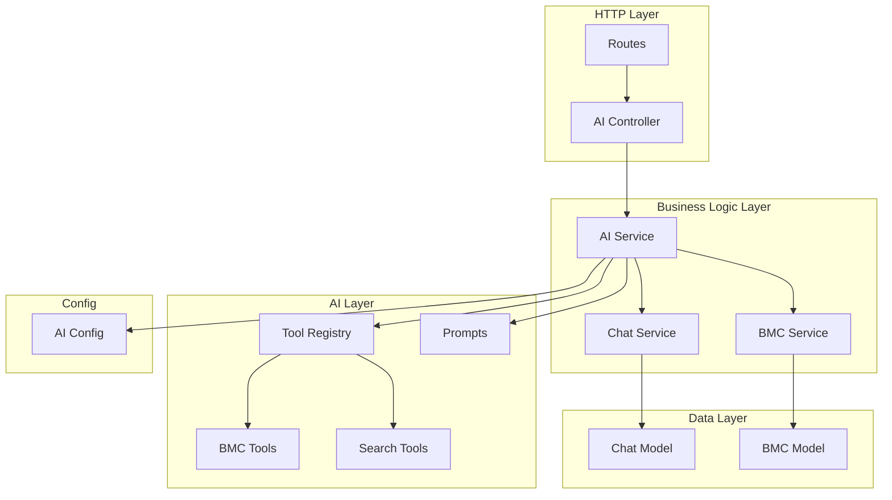

# Design Document: AI Resource Refactor

## Overview

Refactoring ini bertujuan untuk merestrukturisasi resource AI pada backend Kivo API agar lebih maintainable, readable, dan mudah di-manage. Struktur baru akan memisahkan concerns ke dalam module-module yang dedicated sesuai dengan folder structure yang sudah ada.

### Current State Problems
1. **Controller bloat**: `ai.controller.js` berisi tool definitions dengan Zod schemas yang seharusnya terpisah
2. **Service pollution**: `ai.service.js` berisi legacy OpenAI client, unused exports, dan mixed concerns
3. **Duplicate configs**: Provider configuration ada di controller dan service
4. **No separation**: Prompts, tools, dan business logic tercampur dalam satu file

### Target State
```
src/app/
├── config/
│   └── ai.config.js          # AI provider configuration
├── controllers/
│   └── ai.controller.js      # HTTP handling only
├── services/
│   ├── ai.service.js         # AI streaming & tool orchestration
│   ├── bmc.service.js        # BMC CRUD operations (existing, enhanced)
│   └── chat.service.js       # Chat CRUD operations (existing)
├── ai/
│   ├── tools/
│   │   ├── index.js          # Tool registry & executor
│   │   ├── bmc.tools.js      # BMC-related tools
│   │   └── search.tools.js   # Web search tool
│   └── prompts/
│       └── bmc.prompts.js    # BMC system prompts
├── validations/
│   └── ai.validation.js      # Request validation schemas
└── utils/
    └── bmc.utils.js          # BMC tag normalization helpers
```

## Architecture



## Components and Interfaces

### 1. AI Config (`config/ai.config.js`)

Centralized configuration for AI providers.

```javascript
// Interface
export const aiConfig = {
  provider: 'openrouter',
  model: string,
  apiKey: string,
  maxSteps: number,
  toolChoice: 'auto' | 'none' | 'required'
};

export function createAIProvider(): AIProvider;
```

### 2. AI Controller (`controllers/ai.controller.js`)

Thin controller handling only HTTP concerns.

```javascript
// Interface
export async function streamChat(req, res): Promise<Response>;
export async function getChats(req, res): Promise<Response>;
export async function getChatMessages(req, res): Promise<Response>;
export async function deleteChatById(req, res): Promise<Response>;
```

### 3. AI Service (`services/ai.service.js`)

Core AI logic including streaming and tool orchestration.

```javascript
// Interface
export async function processStreamChat(params: {
  chatId: string,
  messages: UIMessage[],
  userId: string,
  onChunk: (chunk) => void
}): Promise<StreamResult>;

export function buildSystemPrompt(context: { bmcId?: string }): string;
```

### 4. Tool Registry (`ai/tools/index.js`)

Central registry for all AI tools.

```javascript
// Interface
export function getTools(userId: string): Record<string, Tool>;
export async function executeTool(
  toolName: string, 
  args: unknown, 
  userId: string
): Promise<ToolResult>;
```

### 5. BMC Tools (`ai/tools/bmc.tools.js`)

BMC-specific tool definitions.

```javascript
// Interface
export function createBmcTools(userId: string): {
  getUserCoordinates: Tool,
  postBmcToDatabase: Tool,
  updateBmcToDatabase: Tool
};
```

### 6. Search Tools (`ai/tools/search.tools.js`)

Web search tool definition.

```javascript
// Interface
export function createSearchTools(): {
  performWebSearch: Tool
};
```

### 7. BMC Prompts (`ai/prompts/bmc.prompts.js`)

System prompts for BMC assistant.

```javascript
// Interface
export const BMC_SYSTEM_PROMPT: string;
export function buildDynamicPrompt(context: { bmcId?: string }): string;
```

### 8. BMC Utils (`utils/bmc.utils.js`)

Helper functions for BMC data processing.

```javascript
// Interface
export const VALID_BMC_TAGS: string[];
export function normalizeTag(tag: string): string;
export function normalizeBmcData(bmcData: BmcItem[]): BmcItem[];
export function validateBmcData(bmcData: unknown): ValidationResult;
```

## Data Models

### Existing Models (No Changes)

**Chat Model** (`models/chat.model.js`)
- `_id`: UUID string from frontend
- `userId`: string
- `title`: string
- `timestamps`: auto

**Message Model** (`models/chat.model.js`)
- `chatId`: string (ref to Chat)
- `content`: string
- `role`: 'user' | 'assistant' | 'system' | 'tool'
- `tool_calls`: array (optional)
- `tool_call_id`: string (optional)

**BMC Model** (`models/bmc.model.js`)
- `coordinat`: { lat, long, alt }
- `authorId`: string
- `isPublic`: boolean
- `items`: array of { tag, content }

## Correctness Properties

*A property is a characteristic or behavior that should hold true across all valid executions of a system-essentially, a formal statement about what the system should do. Properties serve as the bridge between human-readable specifications and machine-verifiable correctness guarantees.*

### Property 1: Tool parameter validation consistency
*For any* tool parameters input, validation using Zod schemas SHALL correctly identify valid inputs as valid and invalid inputs as invalid, with no false positives or false negatives for the defined schema constraints.
**Validates: Requirements 2.3**

### Property 2: Dynamic prompt contains BMC ID
*For any* non-null BMC ID string passed to the prompt builder function, the resulting prompt string SHALL contain that exact BMC ID.
**Validates: Requirements 3.3**

### Property 3: Error response format consistency
*For any* error thrown during request processing, the controller SHALL return a response with `success: false` and a `message` field containing error information.
**Validates: Requirements 4.3**

### Property 4: BMC data validation correctness
*For any* BMC data input, the validation function SHALL return valid for arrays containing objects with valid tags and non-empty content, and invalid otherwise.
**Validates: Requirements 6.2**

### Property 5: Tag normalization idempotence
*For any* tag string, applying normalization twice SHALL produce the same result as applying it once (idempotent operation).
**Validates: Requirements 6.3**

### Property 6: Tag normalization to snake_case
*For any* valid BMC tag in camelCase, PascalCase, or snake_case format, normalization SHALL produce the corresponding snake_case tag from the valid tags list.
**Validates: Requirements 6.3**

## Error Handling

### Error Categories

1. **Validation Errors (400)**
   - Empty messages array
   - Invalid chat ID format
   - Invalid BMC data structure

2. **Authentication Errors (401)**
   - Missing auth token
   - Invalid auth token

3. **Authorization Errors (404)**
   - Chat not owned by user
   - BMC not owned by user

4. **Server Errors (500)**
   - AI provider errors
   - Database errors
   - Tool execution errors

### Error Response Format

```javascript
{
  success: false,
  message: string,
  error?: string  // Only in development
}
```

## Testing Strategy

### Dual Testing Approach

Testing akan menggunakan kombinasi unit tests dan property-based tests untuk coverage yang komprehensif.

### Property-Based Testing

**Library**: `fast-check` dengan Vitest

Property-based tests akan memvalidasi correctness properties yang didefinisikan di atas:

1. **Tool Parameter Validation** - Generate random valid/invalid parameters, verify validation results
2. **Dynamic Prompt Builder** - Generate random BMC IDs, verify prompt contains ID
3. **Error Response Format** - Generate various error types, verify response structure
4. **BMC Data Validation** - Generate random BMC data structures, verify validation correctness
5. **Tag Normalization** - Generate random tag formats, verify normalization consistency

**Configuration**: Minimum 100 iterations per property test.

**Annotation Format**: Each property test MUST be tagged with:
```javascript
// **Feature: ai-resource-refactor, Property {number}: {property_text}**
```

### Unit Testing

Unit tests akan cover:
- Config module exports correct provider
- Tools module exports expected tool definitions
- Prompts module exports expected prompt strings
- Controller delegates to service correctly
- Service orchestrates tools correctly

### Test File Structure

```
tests/
├── ai/
│   ├── tools/
│   │   ├── bmc.tools.test.js
│   │   └── search.tools.test.js
│   └── prompts/
│       └── bmc.prompts.test.js
├── services/
│   └── ai.service.test.js
├── utils/
│   └── bmc.utils.test.js
└── properties/
    └── ai.properties.test.js  # Property-based tests
```
